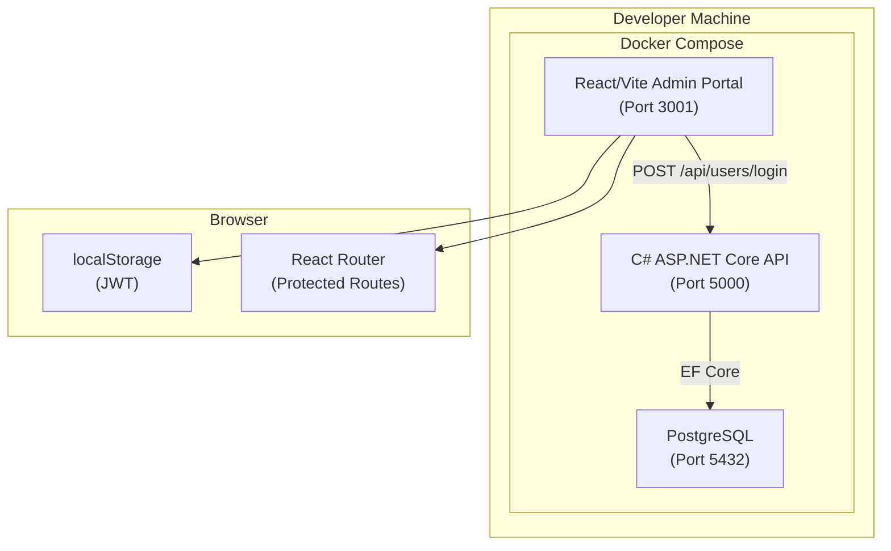

# Design Document

## Overview

The Admin Portal is a React + Vite + TypeScript web application that provides an administrative interface for the Wutsup platform. It is a separate project from the existing React Native mobile client, located in the `/admin` folder, and communicates with the existing C# ASP.NET Core API.

The initial scope delivers:
- A scaffolded React/Vite/TypeScript project with strict mode
- A `users` table in PostgreSQL with EF Core migration
- A `PasswordHasher` service using BCrypt for secure credential storage
- A `UsersController` with a `POST /api/users/login` endpoint that issues JWTs
- JWT configuration (secret, expiry) managed through environment config and validated at startup
- A Login Page and a protected Dashboard Page with React Router
- JWT stored in `localStorage` with session restoration on reload
- CORS configuration on the API to allow the admin origin
- Docker Compose integration with a new `admin` service on port 3001

## Architecture



**Key architectural decisions:**

1. **Vite over CRA** — Vite provides fast HMR and a straightforward build pipeline for a standalone web app. The admin portal is not a mobile app, so Expo/React Native is not used.
2. **React Router v6** — File-based routing is not needed here; React Router's `<Navigate>` component handles protected route redirects cleanly.
3. **JWT in localStorage** — Simpler than cookie-based auth for an internal admin tool. The requirements explicitly specify localStorage.
4. **BCrypt for password hashing** — BCrypt is a well-established adaptive hashing algorithm (via `BCrypt.Net-Next`) that satisfies the requirement for a secure, adaptive algorithm.
5. **ConfigValidator extension** — The existing `ConfigValidator` pattern is extended to include `Jwt:Secret` and `Jwt:ExpiryMinutes`, keeping startup validation consistent.
6. **CORS origin from config** — The allowed admin origin is read from `Cors:AdminOrigin` in appsettings, not hardcoded.
7. **Nginx in Docker** — The admin Dockerfile uses a multi-stage build: Node builds the Vite app, then Nginx serves the static output. This is the standard pattern for containerized Vite apps.

## Components and Interfaces

### Admin Portal (React/Vite/TypeScript)

| Component | Location | Responsibility |
|-----------|----------|----------------|
| Config | `/admin/src/services/config.ts` | Load and validate `VITE_API_BASE_URL` from env |
| AuthContext | `/admin/src/contexts/AuthContext.tsx` | Global auth state: JWT, login, logout |
| apiClient | `/admin/src/services/apiClient.ts` | Axios/fetch wrapper configured with base URL |
| LoginPage | `/admin/src/pages/LoginPage.tsx` | Login form, credential submission, error display |
| DashboardPage | `/admin/src/pages/DashboardPage.tsx` | Protected dashboard placeholder with logout |
| ProtectedRoute | `/admin/src/components/ProtectedRoute.tsx` | HOC that redirects unauthenticated users to `/login` |
| App | `/admin/src/App.tsx` | React Router setup, route definitions |

**Config Interface:**

```typescript
interface AdminConfig {
  apiBaseUrl: string;
}

// Throws with descriptive error if VITE_API_BASE_URL is missing or empty
function loadConfig(): AdminConfig;
```

**AuthContext Interface:**

```typescript
interface AuthState {
  token: string | null;
  isAuthenticated: boolean;
}

interface AuthContextValue {
  auth: AuthState;
  login(token: string): void;   // stores JWT in localStorage, updates state
  logout(): void;               // clears JWT from localStorage, updates state
}
```

**Login Request/Response:**

```typescript
interface LoginRequest {
  username: string;
  password: string;
}

interface LoginResponse {
  token: string;
}
```

**ProtectedRoute:**

```typescript
// Renders children if authenticated; redirects to /login otherwise
function ProtectedRoute({ children }: { children: React.ReactNode }): JSX.Element;
```

### API Components

| Component | Location | Responsibility |
|-----------|----------|----------------|
| User (entity) | `/api/Models/User.cs` | EF Core entity for the `users` table |
| LoginRequest (DTO) | `/api/Models/LoginRequest.cs` | Request body for POST /api/users/login |
| LoginResponse (DTO) | `/api/Models/LoginResponse.cs` | Response body containing the JWT |
| IPasswordHasher | `/api/Services/IPasswordHasher.cs` | Interface for hashing and verifying passwords |
| PasswordHasher | `/api/Services/PasswordHasher.cs` | BCrypt-based implementation |
| IJwtService | `/api/Services/IJwtService.cs` | Interface for generating JWTs |
| JwtService | `/api/Services/JwtService.cs` | Generates signed JWTs with role claim and expiry |
| UsersController | `/api/Controllers/UsersController.cs` | POST /api/users/login endpoint |
| ConfigValidator | `/api/Configuration/ConfigValidator.cs` | Extended to include Jwt:Secret, Jwt:ExpiryMinutes |

**IPasswordHasher Interface:**

```csharp
public interface IPasswordHasher
{
    string Hash(string plaintext);
    bool Verify(string plaintext, string hash);
}
```

**IJwtService Interface:**

```csharp
public interface IJwtService
{
    string GenerateToken(string username, string role);
}
```

**UsersController Endpoint:**

```
POST /api/users/login
Content-Type: application/json

Request:  { "username": "admin@example.com", "password": "secret" }
Response 200: { "token": "<signed-jwt>" }
Response 400: (missing/empty username or password)
Response 401: (invalid credentials)
```

### Infrastructure

| Component | File | Responsibility |
|-----------|------|----------------|
| Admin Dockerfile | `/admin/Dockerfile` | Multi-stage: Node build → Nginx serve |
| Docker Compose | `/docker-compose.yml` | New `admin` service on port 3001 |
| Admin env files | `/admin/.env.local`, `/admin/.env.production` | VITE_API_BASE_URL per environment |

## Data Models

### Users Table (Database)

```sql
CREATE TABLE users (
    id          BIGSERIAL PRIMARY KEY,
    username    VARCHAR(255) NOT NULL UNIQUE,   -- email address
    password_hash TEXT NOT NULL,
    role        VARCHAR(100) NOT NULL,           -- extensible: 'user', 'admin', etc.
    created_at  TIMESTAMPTZ NOT NULL DEFAULT NOW(),
    updated_at  TIMESTAMPTZ NOT NULL DEFAULT NOW()
);

CREATE UNIQUE INDEX idx_users_username ON users (username);
```

**EF Core Entity:**

```csharp
public class User
{
    public long Id { get; set; }
    public string Username { get; set; } = string.Empty;   // email
    public string PasswordHash { get; set; } = string.Empty;
    public string Role { get; set; } = string.Empty;
    public DateTimeOffset CreatedAt { get; set; }
    public DateTimeOffset UpdatedAt { get; set; }
}
```

**AppDbContext addition:**

```csharp
public DbSet<User> Users { get; set; } = null!;
```

### JWT Payload

```json
{
  "sub": "admin@example.com",
  "role": "admin",
  "exp": 1700000000,
  "iat": 1699996400
}
```

### Environment Configuration Schema

**API additions to `appsettings.{Environment}.json`:**

```json
{
  "Jwt": {
    "Secret": "<signing-secret-min-32-chars>",
    "ExpiryMinutes": 60
  },
  "Cors": {
    "AdminOrigin": "http://localhost:3001"
  }
}
```

**Admin Portal (`.env.local`):**

```
VITE_API_BASE_URL=http://localhost:5000
```

**Admin Portal (`.env.production`):**

```
VITE_API_BASE_URL=https://api.example.com
```

## Correctness Properties

*A property is a characteristic or behavior that should hold true across all valid executions of a system — essentially, a formal statement about what the system should do. Properties serve as the bridge between human-readable specifications and machine-verifiable correctness guarantees.*

### Property 1: Password hashing is non-reversible and non-trivial

*For any* non-empty plaintext password string, the output of `PasswordHasher.Hash(password)` SHALL be non-empty and SHALL NOT equal the original plaintext.

**Validates: Requirements 3.1**

### Property 2: Password verification round-trip

*For any* non-empty plaintext password, `PasswordHasher.Verify(password, PasswordHasher.Hash(password))` SHALL return `true`, and for any two distinct non-empty passwords `p1` and `p2`, `PasswordHasher.Verify(p2, PasswordHasher.Hash(p1))` SHALL return `false`.

**Validates: Requirements 3.2**

### Property 3: Login endpoint rejects empty credentials

*For any* login request where the username or password field is empty or whitespace-only, the `POST /api/users/login` endpoint SHALL return HTTP 400.

**Validates: Requirements 4.4**

### Property 4: Login endpoint returns 401 for invalid credentials without distinguishing information

*For any* credential pair where the username does not exist in the system OR the password does not match the stored hash, the `POST /api/users/login` endpoint SHALL return HTTP 401, and the response body SHALL NOT contain information that distinguishes between an unknown username and an incorrect password.

**Validates: Requirements 4.3**

### Property 5: JWT contains role claim matching the user's stored role

*For any* user with any role string, the JWT returned by a successful login SHALL contain a `role` claim whose value equals the user's stored role.

**Validates: Requirements 4.5**

### Property 6: JWT expiry reflects configured duration

*For any* configured `Jwt:ExpiryMinutes` value, the JWT issued by a successful login SHALL have an `exp` claim that is approximately `iat + (ExpiryMinutes * 60)` seconds.

**Validates: Requirements 4.6**

### Property 7: ConfigValidator reports missing JWT configuration keys

*For any* non-empty subset of required configuration keys (including `Jwt:Secret` and `Jwt:ExpiryMinutes`) that is absent from the configuration, `ConfigValidator.Validate()` SHALL return a list containing exactly the names of the absent keys.

**Validates: Requirements 5.3, 5.4**

### Property 8: Admin Portal config loader reports missing VITE_API_BASE_URL

*For any* configuration where `VITE_API_BASE_URL` is missing or empty, the Admin Portal config loader SHALL throw an error whose message identifies the missing variable name.

**Validates: Requirements 10.2**

### Property 9: Login form does not submit with empty fields

*For any* combination where the email field or the password field is empty or whitespace-only, activating the submit button SHALL NOT trigger an API call and SHALL display a validation error.

**Validates: Requirements 6.5**

### Property 10: JWT storage and retrieval round-trip

*For any* JWT string returned by a successful login, the Admin Portal SHALL store it in `localStorage` such that reading `localStorage` immediately after login returns the same JWT string.

**Validates: Requirements 7.1**

### Property 11: Unauthenticated navigation to protected route redirects to login

*For any* unauthenticated session state (no JWT in localStorage, or an expired JWT), navigating to the Dashboard route SHALL result in a redirect to the Login Page.

**Validates: Requirements 7.3, 8.1, 8.2**

### Property 12: Logout clears JWT and redirects to login

*For any* JWT stored in `localStorage`, triggering the logout action SHALL result in `localStorage` containing no JWT and the user being redirected to the Login Page.

**Validates: Requirements 8.5**

## Error Handling

| Scenario | Component | Behavior |
|----------|-----------|----------|
| `VITE_API_BASE_URL` missing at startup | Admin Config | Throws with descriptive error naming the missing variable; app renders an error screen instead of the normal UI |
| `Jwt:Secret` or `Jwt:ExpiryMinutes` missing at API startup | ConfigValidator | Returns missing keys; Program.cs throws `InvalidOperationException` and prevents startup |
| Invalid credentials submitted to login | UsersController | Returns HTTP 401 with a generic message; no distinction between unknown user and wrong password |
| Empty/missing fields in login request body | UsersController | Returns HTTP 400 |
| Login form submitted with empty email or password | LoginPage | Displays inline validation error; does not call the API |
| API returns 401 on login | LoginPage | Displays "Invalid credentials" error message |
| API unreachable during login | LoginPage | Displays a generic network error message |
| Duplicate username on user creation | Database | Unique constraint violation; API returns HTTP 409 (future endpoint) |
| Expired JWT on page load | AuthContext | Detects expiry, clears localStorage, redirects to login |
| Unauthenticated access to protected route | ProtectedRoute | Redirects to `/login` via React Router `<Navigate>` |

## Testing Strategy

### Unit Tests

**Admin Portal (Jest + React Testing Library):**
- `LoginPage`: Verify form renders with email, password, and submit button; verify validation errors on empty fields; verify API call on valid submission; verify error display on 401; verify button disabled during request.
- `DashboardPage`: Verify placeholder content renders; verify logout clears localStorage and redirects.
- `ProtectedRoute`: Verify redirect to `/login` when unauthenticated; verify children render when authenticated.
- `AuthContext`: Verify `login()` stores JWT in localStorage; verify `logout()` removes JWT; verify initial state reads from localStorage.
- `config.ts`: Verify error thrown when `VITE_API_BASE_URL` is missing.

**API (xUnit):**
- `PasswordHasher`: Verify `Hash()` returns non-empty string different from input; verify `Verify()` returns true for correct password and false for incorrect.
- `JwtService`: Verify generated token contains expected claims (sub, role, exp).
- `UsersController`: Verify 400 on missing fields; verify 401 on invalid credentials; verify 200 + JWT on valid credentials.
- `ConfigValidator`: Verify `Jwt:Secret` and `Jwt:ExpiryMinutes` are included in required keys.

### Property-Based Tests

Property-based testing applies to the password hashing, JWT generation, configuration validation, and client-side form/auth logic. The following libraries are used:

- **Admin Portal (TypeScript)**: `fast-check` — minimum 100 iterations per property
- **API (C#)**: `FsCheck` with xUnit adapter — minimum 100 iterations per property

Each property test is tagged with a comment referencing the design property:
- Format: `Feature: admin-portal, Property {number}: {description}`

Properties to implement:

| Property | Library | Location |
|----------|---------|----------|
| 1: Password hashing is non-reversible | FsCheck | `tests/Wutsup.Api.Tests/PasswordHasherPropertyTests.cs` |
| 2: Password verification round-trip | FsCheck | `tests/Wutsup.Api.Tests/PasswordHasherPropertyTests.cs` |
| 3: Login endpoint rejects empty credentials | FsCheck | `tests/Wutsup.Api.Tests/UsersControllerPropertyTests.cs` |
| 4: Login endpoint returns 401 for invalid credentials | FsCheck | `tests/Wutsup.Api.Tests/UsersControllerPropertyTests.cs` |
| 5: JWT contains role claim | FsCheck | `tests/Wutsup.Api.Tests/JwtServicePropertyTests.cs` |
| 6: JWT expiry reflects configured duration | FsCheck | `tests/Wutsup.Api.Tests/JwtServicePropertyTests.cs` |
| 7: ConfigValidator reports missing JWT keys | FsCheck | `tests/Wutsup.Api.Tests/ConfigValidatorPropertyTests.cs` |
| 8: Admin config loader reports missing env var | fast-check | `admin/__tests__/properties/config.property.test.ts` |
| 9: Login form does not submit with empty fields | fast-check | `admin/__tests__/properties/loginPage.property.test.ts` |
| 10: JWT storage round-trip | fast-check | `admin/__tests__/properties/auth.property.test.ts` |
| 11: Unauthenticated navigation redirects to login | fast-check | `admin/__tests__/properties/auth.property.test.ts` |
| 12: Logout clears JWT and redirects | fast-check | `admin/__tests__/properties/auth.property.test.ts` |

### Integration Tests

- **Login endpoint end-to-end**: Start API with test database, create a user, POST valid credentials, verify 200 + valid JWT.
- **CORS preflight**: Send OPTIONS request from admin origin, verify `Access-Control-Allow-Origin` header is present.
- **Migration applies on startup**: Start API in Local mode, verify `users` table exists in PostgreSQL.

### Smoke Tests

- **Admin project structure**: Verify `/admin/src`, `/admin/package.json`, `/admin/tsconfig.json` exist.
- **TypeScript strict mode**: Verify `admin/tsconfig.json` has `"strict": true`.
- **Dockerfile exists**: Verify `/admin/Dockerfile` exists.
- **Docker Compose admin service**: Verify `docker-compose.yml` contains an `admin` service definition.
- **Environment files exist**: Verify `/admin/.env.local` and `/admin/.env.production` exist.
