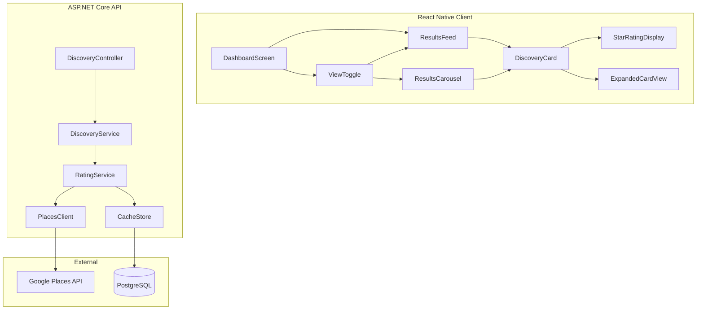

# Design Document: Discovery Ratings & Reviews

## Overview

This feature enriches the existing discovery system with Google Places ratings and reviews, expandable detail cards, and a view toggle between list and carousel modes. The architecture introduces a server-side caching layer to minimize Google Places API calls, a new `RatingService` that enriches discovery items with rating data, and client-side components for star display, card expansion, and view mode switching.

The design prioritizes graceful degradation — if Google Places or the cache is unavailable, discovery items are still returned without rating data. The caching strategy uses PostgreSQL (the existing database) to avoid introducing new infrastructure dependencies.

## Architecture



**Data Flow:**
1. Client requests discovery items via existing endpoint
2. `DiscoveryService` fetches items from the database
3. `RatingService` enriches each item: checks cache → calls Google Places if needed → stores result
4. Enriched DTOs are returned to the client
5. Client renders star ratings on cards, supports expand/collapse, and offers list/carousel toggle

## Components and Interfaces

### API Components

#### IPlacesClient

HTTP client for Google Places API communication.

```csharp
public interface IPlacesClient
{
    /// <summary>
    /// Resolves a place ID and fetches rating data for a discovery item.
    /// Returns null if no matching place is found.
    /// </summary>
    Task<PlacesRatingResult?> GetRatingAsync(string name, double latitude, double longitude, CancellationToken ct = default);
}
```

#### IRatingService

Orchestrates cache lookup and Places API calls.

```csharp
public interface IRatingService
{
    /// <summary>
    /// Returns rating data for a discovery item, using cache when available.
    /// Returns null if rating data cannot be obtained.
    /// </summary>
    Task<RatingData?> GetRatingForItemAsync(int discoveryItemId, string name, double latitude, double longitude, CancellationToken ct = default);

    /// <summary>
    /// Enriches a list of discovery item DTOs with rating data.
    /// Items that cannot be enriched retain null rating fields.
    /// </summary>
    Task<List<EnrichedDiscoveryItemDto>> EnrichItemsAsync(List<DiscoveryItemDto> items, CancellationToken ct = default);
}
```

#### IRatingCacheStore

PostgreSQL-backed cache for Google Places responses.

```csharp
public interface IRatingCacheStore
{
    Task<RatingCacheEntry?> GetAsync(int discoveryItemId, CancellationToken ct = default);
    Task SetAsync(int discoveryItemId, RatingData data, TimeSpan ttl, CancellationToken ct = default);
}
```

### Client Components

#### StarRatingDisplay

Renders a 0–5 star rating using Ionicons (`star`, `star-half`, `star-outline`).

```typescript
interface StarRatingDisplayProps {
  rating: number;       // 0–5 scale
  reviewCount?: number; // optional review count to display
}
```

- Renders 5 star icons: filled for whole stars, half-filled for 0.25–0.74 remainder, empty for the rest
- Displays numeric rating text (e.g., "4.3")
- Provides `accessibilityLabel`: "Rated {rating} out of 5 stars"

#### ExpandedCardView

Renders the detail section when a card is expanded.

```typescript
interface ExpandedCardViewProps {
  reviews: Review[];
  menuMetadata?: MenuInfo;
  eventMetadata?: EventInfo;
}
```

#### ViewToggle

Switches between list and carousel view modes.

```typescript
interface ViewToggleProps {
  mode: 'list' | 'carousel';
  onModeChange: (mode: 'list' | 'carousel') => void;
}
```

#### ResultsCarousel

Horizontal swipeable view showing one full-detail card at a time.

```typescript
interface ResultsCarouselProps {
  activeNodeId: number | null;
  visible: boolean;
}
```

## Data Models

### API Models

#### RatingData

```csharp
public record RatingData(
    double Rating,           // 0–5 scale
    int ReviewCount,
    List<ReviewData> Reviews // up to 5 reviews
);

public record ReviewData(
    string AuthorName,
    double Rating,           // individual review rating
    string Text,
    string RelativeTimeDescription
);
```

#### RatingCacheEntry (Entity)

```csharp
public class RatingCacheEntry
{
    public int Id { get; set; }
    public int DiscoveryItemId { get; set; }
    public string RatingDataJson { get; set; } = string.Empty; // serialized RatingData
    public DateTimeOffset CachedAt { get; set; }
    public DateTimeOffset ExpiresAt { get; set; }
}
```

Database table: `rating_cache`
- Primary key: `id` (auto-increment)
- Unique index on `discovery_item_id`
- Index on `expires_at` for cleanup queries

#### EnrichedDiscoveryItemDto

Extends the existing DTO with rating fields:

```csharp
public record EnrichedDiscoveryItemDto(
    int Id,
    string Name,
    string Description,
    double Latitude,
    double Longitude,
    string City,
    string? Address,
    string? ImageUrl,
    int NavigationNodeId,
    string CategoryLabel,
    object? Metadata,
    RatingData? Rating  // null when no rating available
);
```

### Client Models

```typescript
export interface Review {
  authorName: string;
  rating: number;
  text: string;
  relativeTimeDescription: string;
}

export interface RatingData {
  rating: number;
  reviewCount: number;
  reviews: Review[];
}

// Extended DiscoveryItem (adds to existing interface)
export interface DiscoveryItem {
  // ... existing fields ...
  rating: RatingData | null;
}
```

### Configuration

API `appsettings.json` additions:

```json
{
  "GooglePlaces": {
    "ApiKey": "<secret>",
    "BaseUrl": "https://maps.googleapis.com/maps/api/place",
    "TimeoutSeconds": 5
  },
  "RatingCache": {
    "TtlMinutes": 1440
  }
}
```

- `TtlMinutes`: Configurable TTL for cache entries (default: 24 hours / 1440 minutes)
- `TimeoutSeconds`: HTTP timeout for Google Places calls

## Correctness Properties

*A property is a characteristic or behavior that should hold true across all valid executions of a system — essentially, a formal statement about what the system should do. Properties serve as the bridge between human-readable specifications and machine-verifiable correctness guarantees.*

### Property 1: Places API response parsing preserves data

*For any* valid Google Places API response containing a rating (0–5) and up to 5 reviews, parsing the response into a `PlacesRatingResult` SHALL preserve the rating value and all review fields (author name, rating, text, relative time) without data loss, and the review count SHALL never exceed 5.

**Validates: Requirements 1.2**

### Property 2: API errors produce null rating without throwing

*For any* Google Places API error response (HTTP 4xx, 5xx, timeout, network failure), the `RatingService` SHALL return null rating data for the requested item without throwing an exception, and the discovery item SHALL remain intact.

**Validates: Requirements 1.3, 1.4**

### Property 3: Cache hit returns stored data without external API call

*For any* discovery item ID with a cached entry whose `ExpiresAt` is in the future, the `RatingService` SHALL return the cached `RatingData` without invoking the `PlacesClient`.

**Validates: Requirements 2.1, 2.2**

### Property 4: Cache miss fetches from API and stores by item ID

*For any* discovery item ID without a cached entry (or with an expired entry), the `RatingService` SHALL call the `PlacesClient`, and if successful, store the result in the cache keyed by that item ID with the configured TTL.

**Validates: Requirements 2.3, 2.4**

### Property 5: Star rating display correctness

*For any* rating value `r` where `0 ≤ r ≤ 5`, the `StarRatingDisplay` SHALL render exactly 5 star icons whose filled/half/empty breakdown correctly represents `r`, display the numeric value as text, and provide an accessibility label of the form "Rated {r} out of 5 stars".

**Validates: Requirements 3.1, 3.2, 3.4**

### Property 6: Response DTO includes rating fields with correct structure

*For any* set of discovery items (some with cached ratings, some without), the enriched response DTO SHALL include a `rating` field for every item — containing `rating` (number 0–5), `reviewCount` (number), and `reviews` (array of up to 5 objects with `authorName`, `rating`, `text`, `relativeTimeDescription`) when data is available, or null when unavailable — without failing the request.

**Validates: Requirements 6.1, 6.3, 6.4**

### Property 7: Enrichment applies cached data to all items

*For any* list of discovery items passed to `EnrichItemsAsync`, every item with a valid cache entry SHALL have its rating data populated in the response, and the total number of items in the response SHALL equal the total number of items in the input.

**Validates: Requirements 6.2**

### Property 8: At most one card expanded at a time

*For any* sequence of tap actions on discovery cards in the results feed, at most one card SHALL be in the expanded state at any given time.

**Validates: Requirements 4.7**

### Property 9: Carousel cards display all detail sections

*For any* discovery item displayed in carousel view that has rating data, reviews, menu metadata, or event metadata, the carousel card SHALL render all available detail sections (star rating, reviews, menu, events) without requiring a tap to expand.

**Validates: Requirements 5.9**

## Error Handling

| Scenario | Behavior |
|----------|----------|
| Google Places API timeout (>5s) | Return item without rating; log warning |
| Google Places API HTTP error (4xx/5xx) | Return item without rating; log error with status code |
| Google Places returns no matching place | Return item with null rating (no log — expected case) |
| Cache store unreachable (DB connection failure) | Fall back to calling Places API directly; log cache failure |
| Cache read/write exception | Swallow exception, proceed without cache; log error |
| Invalid/corrupt cached data (JSON parse failure) | Treat as cache miss; delete corrupt entry; log warning |
| Network failure to Google Places | Return item without rating; log error |
| Rating value outside 0–5 range from API | Clamp to 0–5 range; log warning |

**Design Principle:** The rating enrichment layer is entirely optional. Any failure in the rating pipeline results in the discovery item being returned without rating data — never in a failed request.

## Testing Strategy

### Property-Based Tests (PBT)

PBT is appropriate for this feature because:
- The rating service has pure logic for parsing, caching decisions, and DTO construction
- The star rating display has clear mathematical properties (star breakdown for any rating 0–5)
- Input spaces are large (rating values, review text, cache timestamps)

**Client (Jest + fast-check):**
- `StarRatingDisplay` star breakdown correctness (Property 5)
- Carousel card detail rendering completeness (Property 9)
- Single-expanded-card invariant (Property 8)

Configuration: minimum 100 iterations per property (`numRuns: 100`)
Tag format: `// Feature: discovery-ratings-reviews, Property N: description`

**API (xUnit + FsCheck):**
- Places API response parsing (Property 1)
- Error resilience — null rating on any error (Property 2)
- Cache hit behavior (Property 3)
- Cache miss behavior (Property 4)
- Response DTO structure (Property 6)
- Enrichment completeness (Property 7)

Configuration: minimum 100 iterations per property (`MaxTest = 100`)
Tag format: `// Feature: discovery-ratings-reviews, Property N: description`

### Unit Tests (Example-Based)

**Client:**
- DiscoveryCard renders without rating section when rating is null (3.3)
- ExpandedCardView shows reviews when present (4.2)
- ExpandedCardView shows menu metadata when present (4.3)
- ExpandedCardView shows event metadata when present (4.4)
- Card expand/collapse on tap (4.1, 4.5)
- Animation duration is 300ms (4.6)
- ViewToggle renders both options (5.1)
- ViewToggle defaults to list view (5.7)
- List view renders FlatList (5.2)
- Carousel view renders horizontal scroll (5.3)

**API:**
- `PlacesClient` constructs correct URL with name and coordinates
- `RatingCacheStore` CRUD operations
- Configuration validation for GooglePlaces settings

### Integration Tests

**API:**
- Full enrichment pipeline with real database (cache read/write)
- Discovery endpoint returns enriched DTOs
- Cache expiry triggers re-fetch

### Test File Locations

| Test | Location |
|------|----------|
| Client property tests | `client/__tests__/properties/discoveryRatings.property.test.ts` |
| Client unit tests | `client/components/StarRatingDisplay.test.ts`, `client/components/ExpandedCardView.test.ts` |
| API property tests | `tests/Wutsup.Api.Tests/RatingServicePropertyTests.cs` |
| API unit tests | `tests/Wutsup.Api.Tests/RatingServiceTests.cs`, `tests/Wutsup.Api.Tests/PlacesClientTests.cs` |
