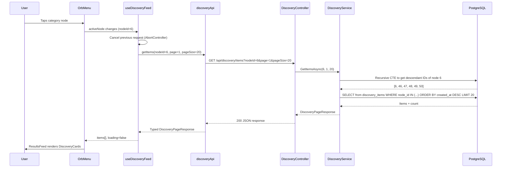
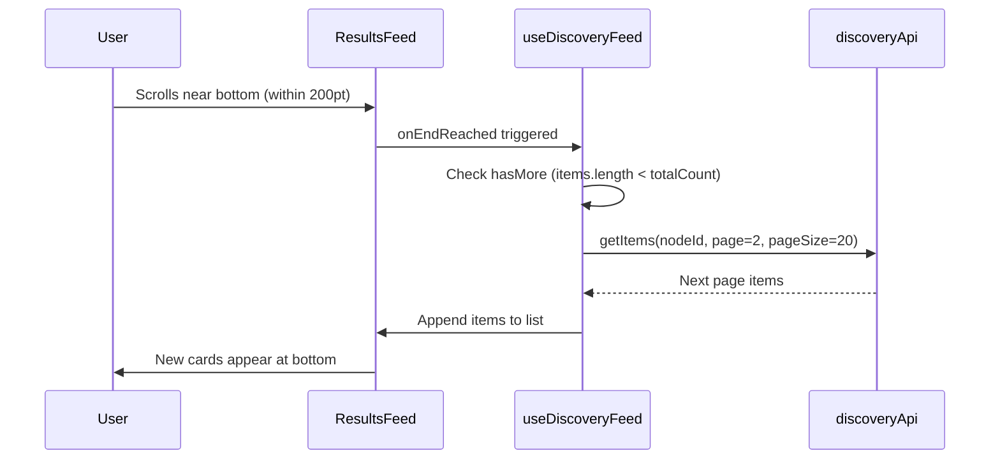

# Design Document — Discovery Results Feed

## Overview

This feature adds a contextual results feed to the bottom half of the Dashboard screen, driven by the user's current position in the Drill Orb navigation tree. When the Orb Menu is open and the user selects a category (e.g., Events), the feed displays discovery items from that node and all its descendants. As the user drills deeper, the feed narrows. The feature spans the full stack: a new `DiscoveryItem` EF Core entity with JSONB metadata, a `DiscoveryService` that resolves descendant nodes and queries items, a paginated REST endpoint, a mock data seeder (500+ items via EF Core migration), a typed client API module, a reactive `useDiscoveryFeed` hook, and card-based UI components.

### Key Design Decisions

- **Descendant resolution via recursive CTE**: The `DiscoveryService` uses a PostgreSQL recursive CTE to resolve all descendant node IDs for a given node in a single query, avoiding multiple round-trips or in-memory tree traversal.
- **JSONB metadata column**: Category-specific fields (event dates, price ranges, cuisine types) live in a flexible JSONB column, avoiding schema migrations for new field types.
- **Composite index on `(navigation_node_id, created_at)`**: Supports the primary query pattern — filter by category, order by recency — with a single index scan.
- **`useDiscoveryFeed` hook with AbortController**: Cancels in-flight requests when the active node changes, preventing stale data from appearing in the feed.
- **FlatList with `onEndReached`**: Uses React Native's virtualized list for infinite scroll, appending pages without re-rendering existing items.
- **Feed visibility tied to `orbState`**: The ResultsFeed renders only when the Orb Menu is open, using Reanimated for enter/exit transitions.
- **Separate mock data migration**: Keeps seed data isolated from schema changes, making it easy to reset or extend.

---

## Architecture

```
api/
├── Controllers/
│   └── DiscoveryController.cs       ← new: GET /api/discovery/items
├── Models/
│   ├── DiscoveryItem.cs             ← new: EF Core entity
│   ├── DiscoveryItemDto.cs          ← new: response DTO
│   └── DiscoveryPageResponse.cs     ← new: paginated response wrapper
├── Services/
│   ├── IDiscoveryService.cs         ← new: interface
│   └── DiscoveryService.cs          ← new: descendant resolution + query
├── Data/
│   └── AppDbContext.cs              ← updated: add DiscoveryItems DbSet
└── Migrations/
    ├── ..._AddDiscoveryItems.cs     ← new: table + indexes
    └── ..._SeedDiscoveryItems.cs    ← new: 500+ mock items

client/
├── services/
│   └── discoveryApi.ts              ← new: typed API client
├── hooks/
│   └── useDiscoveryFeed.ts          ← new: reactive feed state management
├── components/
│   ├── ResultsFeed.tsx              ← new: FlatList-based feed container
│   └── DiscoveryCard.tsx            ← new: individual item card
├── screens/
│   └── DashboardScreen.tsx          ← updated: integrate ResultsFeed
└── __tests__/properties/
    └── discoveryFeed.property.test.ts ← new: fast-check property tests

tests/Wutsup.Api.Tests/
└── DiscoveryServicePropertyTests.cs  ← new: FsCheck property tests
```

### Data Flow — Feed Loading



### Data Flow — Infinite Scroll



---

## Components and Interfaces

### `DiscoveryController.cs`

```csharp
[ApiController]
[Route("api/discovery")]
public class DiscoveryController : ControllerBase
{
    private readonly IDiscoveryService _discoveryService;

    [HttpGet("items")]
    public async Task<IActionResult> GetItems(
        [FromQuery] int nodeId,
        [FromQuery] int page = 1,
        [FromQuery] int pageSize = 20);
}
```

- Validates `nodeId` exists (returns 404 if not)
- Clamps `pageSize` to max 100
- Delegates to `IDiscoveryService.GetItemsAsync`

### `IDiscoveryService.cs`

```csharp
public interface IDiscoveryService
{
    Task<DiscoveryPageResponse> GetItemsAsync(int nodeId, int page, int pageSize);
}
```

### `DiscoveryService.cs`

```csharp
public class DiscoveryService : IDiscoveryService
{
    private readonly AppDbContext _dbContext;

    public async Task<DiscoveryPageResponse> GetItemsAsync(int nodeId, int page, int pageSize)
    {
        // 1. Verify node exists
        // 2. Recursive CTE to get all descendant node IDs (including nodeId itself)
        // 3. Query discovery_items WHERE navigation_node_id IN (descendantIds)
        //    ORDER BY created_at DESC
        //    with OFFSET/LIMIT pagination
        // 4. Join navigation_nodes to get categoryLabel
        // 5. Return DiscoveryPageResponse with items, totalCount, page, pageSize
    }
}
```

The recursive CTE:
```sql
WITH RECURSIVE descendants AS (
    SELECT id FROM navigation_nodes WHERE id = @nodeId
    UNION ALL
    SELECT n.id FROM navigation_nodes n
    INNER JOIN descendants d ON n.parent_id = d.id
)
SELECT id FROM descendants;
```

### `discoveryApi.ts`

```typescript
export interface DiscoveryItem {
  id: number;
  name: string;
  description: string;
  latitude: number;
  longitude: number;
  city: string;
  address: string | null;
  imageUrl: string | null;
  navigationNodeId: number;
  categoryLabel: string;
  metadata: Record<string, unknown> | null;
}

export interface DiscoveryPageResponse {
  items: DiscoveryItem[];
  totalCount: number;
  page: number;
  pageSize: number;
}

export class DiscoveryApiError extends Error {
  readonly statusCode: number;
  constructor(message: string, statusCode: number);
}

export interface DiscoveryApiClient {
  getItems(nodeId: number, page?: number, pageSize?: number): Promise<DiscoveryPageResponse>;
}

export function createDiscoveryApiClient(apiBaseUrl: string): DiscoveryApiClient;
```

### `useDiscoveryFeed.ts`

```typescript
export interface UseDiscoveryFeedResult {
  items: DiscoveryItem[];
  loading: boolean;
  loadingMore: boolean;
  error: string | null;
  hasMore: boolean;
  fetchNextPage: () => void;
  retry: () => void;
}

export function useDiscoveryFeed(activeNodeId: number | null): UseDiscoveryFeedResult;
```

Internal behavior:
- Maintains `items: DiscoveryItem[]`, `page: number`, `totalCount: number`
- On `activeNodeId` change: abort in-flight request, reset items/page, fetch page 1
- `fetchNextPage`: increment page, fetch, append results
- `hasMore`: `items.length < totalCount`
- Uses `AbortController` for request cancellation
- Exposes `retry` for failed page loads

### `ResultsFeed.tsx`

```typescript
interface ResultsFeedProps {
  activeNodeId: number | null;
  visible: boolean;
}
```

- Wraps `useDiscoveryFeed` hook
- Renders a `FlatList` of `DiscoveryCard` components
- `onEndReached` triggers `fetchNextPage` (threshold: 200pt via `onEndReachedThreshold`)
- Shows loading spinner at top during initial load
- Shows loading spinner at bottom during page loads
- Shows empty state when items is empty and not loading
- Shows retry button on page fetch failure
- Animated enter/exit via Reanimated `FadeIn`/`FadeOut` (300ms)
- Resets scroll position via `scrollToOffset({ offset: 0 })` when `activeNodeId` changes

### `DiscoveryCard.tsx`

```typescript
interface DiscoveryCardProps {
  item: DiscoveryItem;
}
```

Renders:
- **Name**: Prominent title text (FONT_SIZE.lg, fontWeight 600)
- **Description**: Body text, `numberOfLines={2}` with ellipsis
- **Map thumbnail**: Static map image using item's latitude/longitude (placeholder during dev)
- **City**: Text below/adjacent to map thumbnail
- **Category badge**: Small pill/tag showing `categoryLabel`
- **Image**: Item image when `imageUrl` is present; category-appropriate placeholder icon otherwise
- **Accessibility**: `accessibilityLabel={`${item.name}, ${item.categoryLabel}`}`

---

## Data Models

### API — `DiscoveryItem` Entity

```csharp
public class DiscoveryItem
{
    public int Id { get; set; }
    public string Name { get; set; } = string.Empty;
    public string Description { get; set; } = string.Empty;
    public double Latitude { get; set; }
    public double Longitude { get; set; }
    public string City { get; set; } = string.Empty;
    public string? Address { get; set; }
    public string? ImageUrl { get; set; }
    public int NavigationNodeId { get; set; }
    public NavigationNode NavigationNode { get; set; } = null!;
    public string? Metadata { get; set; }  // stored as JSONB
    public DateTimeOffset CreatedAt { get; set; }
    public DateTimeOffset UpdatedAt { get; set; }
}
```

EF Core table mapping (`discovery_items`):

| Column | Type | Constraints |
|--------|------|-------------|
| `id` | `integer` | PK, identity always |
| `name` | `varchar(500)` | NOT NULL |
| `description` | `text` | NOT NULL |
| `latitude` | `double precision` | NOT NULL |
| `longitude` | `double precision` | NOT NULL |
| `city` | `varchar(255)` | NOT NULL |
| `address` | `varchar(500)` | nullable |
| `image_url` | `varchar(1000)` | nullable |
| `navigation_node_id` | `integer` | NOT NULL, FK → `navigation_nodes.id` |
| `metadata` | `jsonb` | nullable |
| `created_at` | `timestamptz` | NOT NULL, default NOW() |
| `updated_at` | `timestamptz` | NOT NULL, default NOW() |

Indexes:
- `idx_discovery_items_navigation_node_id` on `navigation_node_id`
- `idx_discovery_items_node_created` on `(navigation_node_id, created_at DESC)`

### API — DTOs

```csharp
public record DiscoveryItemDto(
    int Id,
    string Name,
    string Description,
    double Latitude,
    double Longitude,
    string City,
    string? Address,
    string? ImageUrl,
    int NavigationNodeId,
    string CategoryLabel,
    object? Metadata
);

public record DiscoveryPageResponse(
    List<DiscoveryItemDto> Items,
    int TotalCount,
    int Page,
    int PageSize
);
```

### Client — Types

```typescript
export interface DiscoveryItem {
  id: number;
  name: string;
  description: string;
  latitude: number;
  longitude: number;
  city: string;
  address: string | null;
  imageUrl: string | null;
  navigationNodeId: number;
  categoryLabel: string;
  metadata: Record<string, unknown> | null;
}

export interface DiscoveryPageResponse {
  items: DiscoveryItem[];
  totalCount: number;
  page: number;
  pageSize: number;
}
```

### Mock Data Distribution

The seeder generates 500+ items distributed across all leaf nodes in the navigation tree. Items are spread across 3+ cities (e.g., Austin TX, Portland OR, Denver CO) with realistic names and metadata per category:

| Category | Example Names | Metadata Fields |
|----------|--------------|-----------------|
| Rock (node 46) | "The Velvet Underground", "Riff House" | `eventDate`, `venue`, `ticketPrice` |
| Italian (node 51) | "Trattoria Bella", "Nonna's Kitchen" | `cuisineType`, `priceRange`, `rating` |
| Cocktail Bars / Speakeasy (node 66) | "The Hidden Door", "Whisper Room" | `specialty`, `dressCode`, `hoursOfOperation` |
| Hiking (node 57) | "Bear Creek Trail", "Summit Ridge Loop" | `difficulty`, `distance`, `elevation` |
| Yoga (node 42) | "Sunrise Flow Studio", "Zen Space" | `classType`, `level`, `duration` |

---

## Correctness Properties

*A property is a characteristic or behavior that should hold true across all valid executions of a system — essentially, a formal statement about what the system should do. Properties serve as the bridge between human-readable specifications and machine-verifiable correctness guarantees.*

### Property 1: Descendant node resolution correctness

*For any* navigation tree and any node within that tree, querying discovery items for that node SHALL return exactly the items linked to that node or any of its descendants — no items from non-descendant nodes shall be included, and no items from descendant nodes shall be excluded.

**Validates: Requirements 2.2**

---

### Property 2: Pagination slice correctness

*For any* valid `page` and `pageSize` parameters and any result set, the returned items SHALL be the correct ordered slice of the total result set, `totalCount` SHALL equal the total number of matching items, and `items.length` SHALL be ≤ `pageSize`.

**Validates: Requirements 2.3, 2.4**

---

### Property 3: Result ordering invariant

*For any* query that returns multiple discovery items, each item's `created_at` timestamp SHALL be greater than or equal to the next item's `created_at` timestamp (descending order).

**Validates: Requirements 2.6**

---

### Property 4: Response serialization structure

*For any* discovery item returned by the API, the JSON response SHALL use camelCase property names and SHALL include all required fields: `id`, `name`, `description`, `latitude`, `longitude`, `city`, `navigationNodeId`, `categoryLabel`, and `metadata`.

**Validates: Requirements 2.7, 9.1**

---

### Property 5: CategoryLabel join correctness

*For any* discovery item returned by the API, the `categoryLabel` field SHALL equal the `label` of the navigation node referenced by `navigationNodeId`.

**Validates: Requirements 9.2**

---

### Property 6: Serialization round-trip

*For any* valid DiscoveryItem stored in the database, serializing to JSON and deserializing back SHALL produce an equivalent object with all fields preserved, including the JSONB metadata structure.

**Validates: Requirements 9.3, 9.4**

---

### Property 7: Metadata JSONB storage round-trip

*For any* valid JSON object stored in the `metadata` column, retrieving the discovery item SHALL return the same JSON structure without transformation or data loss.

**Validates: Requirements 1.4**

---

### Property 8: DiscoveryCard renders required information

*For any* valid DiscoveryItem, the rendered DiscoveryCard SHALL display the item's name, city, and categoryLabel, and SHALL have an `accessibilityLabel` containing both the item name and category label.

**Validates: Requirements 5.1, 5.4, 5.5, 5.8**

---

### Property 9: Feed reacts to active node changes

*For any* sequence of active node changes, the `useDiscoveryFeed` hook SHALL initiate a new fetch with the most recent nodeId, and the resulting items SHALL correspond to that node (not a previously active node).

**Validates: Requirements 6.1, 6.2, 6.3**

---

### Property 10: Request cancellation on rapid node changes

*For any* rapid sequence of node changes where previous requests have not yet completed, only the response for the final (most recent) nodeId SHALL be used to populate the feed — responses for earlier nodeIds SHALL be discarded.

**Validates: Requirements 7.5**

---

### Property 11: Pagination terminates correctly

*For any* result set where `items.length >= totalCount`, the `useDiscoveryFeed` hook SHALL report `hasMore = false` and SHALL NOT initiate additional page fetches.

**Validates: Requirements 8.3**

---

### Property 12: Page append stability

*For any* sequence of page loads, appending a new page SHALL not modify the items from previously loaded pages — the first N items SHALL remain identical before and after the append.

**Validates: Requirements 8.5**

---

## Error Handling

| Scenario | Handling |
|----------|----------|
| `GET /api/discovery/items` with non-existent `nodeId` | HTTP 404 with `{ message: "Navigation node not found." }` |
| `GET /api/discovery/items` with `pageSize > 100` | Clamp to 100, proceed normally |
| `GET /api/discovery/items` with `page < 1` | Default to page 1 |
| `GET /api/discovery/items` with missing `nodeId` | HTTP 400 with `{ message: "nodeId is required." }` |
| Database connection failure during query | HTTP 500; logged server-side |
| Client fetch fails (network error) | `useDiscoveryFeed` sets `error` state; `retry()` re-attempts |
| Client receives non-200 response | `DiscoveryApiError` thrown with status code; hook sets `error` state |
| Page fetch fails mid-scroll | `loadingMore` set to false; retry button shown at list bottom |
| Active node changes during in-flight request | Previous request aborted via `AbortController`; new request initiated |
| Empty result set | `ResultsFeed` shows empty state message: "No results found for this category" |
| Orb menu closes while feed is loading | Feed animates out; in-flight request is aborted |

---

## Testing Strategy

### Unit / Example Tests

**Client** (`*.test.ts` / `*.test.tsx`):

- `discoveryApi.test.ts` — Mock fetch responses: successful parse, 404 error, network error
- `useDiscoveryFeed.test.ts` — Initial state is loading; successful fetch populates items; error state on failure; page increment on fetchNextPage; reset on nodeId change
- `ResultsFeed.test.tsx` — Renders loading indicator when loading; renders empty state when no items; renders cards when items present; shows retry on error
- `DiscoveryCard.test.tsx` — Renders name, description (truncated), city, category badge; shows placeholder when no imageUrl; correct accessibilityLabel

**API** (`*Tests.cs`):

- `DiscoveryControllerTests.cs` — 404 for non-existent nodeId; 400 for missing nodeId; 200 with correct response shape; pageSize clamped to 100
- `DiscoveryServiceTests.cs` — Descendant resolution with known tree; pagination offset calculation; empty result for leaf with no items

### Property-Based Tests

**Client** — `client/__tests__/properties/discoveryFeed.property.test.ts`

Uses **fast-check** with `numRuns: 100` per property. Each test tagged: `Feature: discovery-results-feed, Property N: <description>`

| Property | Generator | Assertion |
|----------|-----------|-----------|
| 8 — Card renders required info | `fc.record({ id: fc.nat(), name: fc.string({minLength:1}), city: fc.string({minLength:1}), categoryLabel: fc.string({minLength:1}), ... })` | Rendered output contains name, city, categoryLabel; accessibilityLabel contains name and categoryLabel |
| 9 — Feed reacts to node changes | `fc.array(fc.nat({min:1}), {minLength:2, maxLength:5})` for nodeId sequence | After each change, the fetch is called with the latest nodeId |
| 10 — Request cancellation | `fc.array(fc.nat({min:1}), {minLength:2, maxLength:5})` for rapid nodeIds | Only the final nodeId's response populates items |
| 11 — Pagination terminates | `fc.record({ totalCount: fc.nat({max:100}), pageSize: fc.integer({min:1, max:50}) })` | When loaded items >= totalCount, hasMore is false |
| 12 — Page append stability | `fc.array(fc.array(fc.record({...}), {minLength:1, maxLength:20}), {minLength:2, maxLength:4})` for pages | First page items unchanged after appending second page |

**API** — `tests/Wutsup.Api.Tests/DiscoveryServicePropertyTests.cs`

Uses **FsCheck** with xUnit adapter, `MaxTest = 100`. Each test tagged: `Feature: discovery-results-feed, Property N: <description>`

| Property | Generator | Assertion |
|----------|-----------|-----------|
| 1 — Descendant resolution | Random tree (1–4 levels, 2–5 children per node) + random items distributed across nodes | Query for any node returns exactly items on that node or descendants |
| 2 — Pagination slice | Random item count (1–200), random page/pageSize | Returned slice matches expected offset/limit of ordered set |
| 3 — Result ordering | Random items with random created_at timestamps | Returned items are in descending created_at order |
| 4 — Response structure | Random valid DiscoveryItems | All required camelCase fields present in serialized JSON |
| 5 — CategoryLabel correctness | Random items linked to random nodes | categoryLabel matches the node's label |
| 6 — Serialization round-trip | Random DiscoveryItemDto objects | Serialize → deserialize produces equivalent object |
| 7 — Metadata round-trip | Random JSON objects (nested, arrays, strings, numbers, booleans, nulls) | Store in JSONB → retrieve → compare equals original |

### Smoke Tests

- Verify `discovery_items` table exists after migration with correct columns and indexes
- Verify seeder produces ≥ 500 items across ≥ 3 cities
- Verify `GET /api/discovery/items?nodeId=1` returns 200 with items from seeded data

### Integration Tests

- `GET /api/discovery/items?nodeId=6` (Music) returns items from Music and all genre sub-nodes (Rock, Jazz, Electronic, Hip Hop, Classical)
- `GET /api/discovery/items?nodeId=46` (Rock, leaf node) returns only Rock items
- Pagination: page 1 and page 2 return different items with no overlap
- Non-existent nodeId returns 404
- Response includes correct `categoryLabel` for each item
