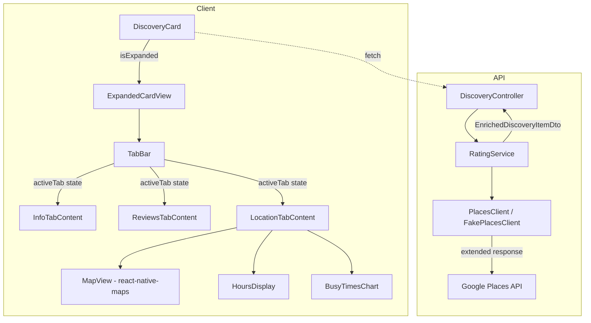
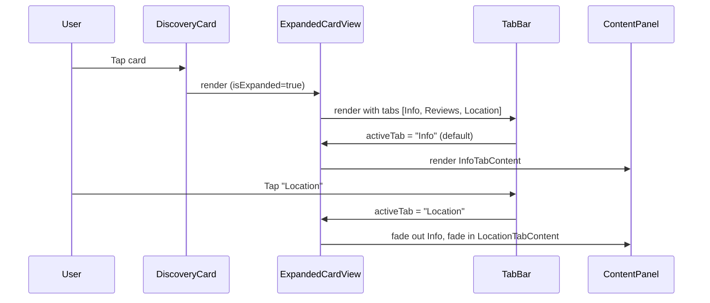

# Design Document: Expanded Card Detail Tabs

## Overview

This feature transforms the existing flat-list `ExpandedCardView` into a tabbed interface with three content sections: **Info**, **Reviews**, and **Location**. The tab system organizes richer place details—including operating hours and busy times—into clearly separated panels, improving discoverability and reducing visual clutter.

The API is extended to fetch hours and busy times from Google Places alongside existing rating data. The `FakePlacesClient` generates deterministic mock data for local development. On the client, a `TabBar` component manages tab state and animated transitions, while each tab renders its own content panel.

## Architecture



### Data Flow

1. `DiscoveryController` calls `RatingService.EnrichItemsAsync()` which calls `IPlacesClient.GetRatingAsync()`.
2. `IPlacesClient` is extended to return `PlacesDetailResult` (renamed from `PlacesRatingResult`) containing rating, reviews, hours, and busy times.
3. The enriched DTO includes `HoursData` and `BusyTimesData` as nullable fields.
4. The client deserializes the response into typed interfaces and passes data to the tab components.
5. `ExpandedCardView` manages active tab state and renders the corresponding content panel with a fade transition.

### Tab Expansion Flow



## Components and Interfaces

### Component Hierarchy

```
ExpandedCardView (refactored)
├── TabBar
│   ├── Tab ("Info") — touchable with active indicator
│   ├── Tab ("Reviews") — touchable with active indicator
│   └── Tab ("Location") — touchable with active indicator
├── InfoTabContent
│   ├── Full description text
│   ├── Address display
│   ├── Category badge
│   ├── Menu items (if available)
│   └── Event details (if available)
├── ReviewsTabContent
│   ├── Overall rating + review count header
│   ├── StarRatingDisplay
│   └── Review list (up to 5)
└── LocationTabContent
    ├── MapView (react-native-maps)
    ├── Address + city text
    ├── HoursDisplay (weekly schedule)
    └── BusyTimesChart (horizontal bar chart)
```

### Component Props Interfaces (Client TypeScript)

```typescript
// TabBar
interface TabBarProps {
  tabs: string[];
  activeTab: string;
  onTabChange: (tab: string) => void;
}

// InfoTabContent
interface InfoTabContentProps {
  description: string;
  address: string | null;
  categoryLabel: string;
  menuMetadata?: MenuInfo;
  eventMetadata?: EventInfo;
}

// ReviewsTabContent
interface ReviewsTabContentProps {
  rating: RatingData | null;
}

// LocationTabContent
interface LocationTabContentProps {
  latitude: number;
  longitude: number;
  address: string | null;
  city: string;
  hours: HoursData | null;
  busyTimes: BusyTimesData | null;
}

// HoursDisplay
interface HoursDisplayProps {
  hours: HoursData;
}

// BusyTimesChart
interface BusyTimesChartProps {
  busyTimes: BusyTimesData;
}
```

### Refactored ExpandedCardView Props

```typescript
interface ExpandedCardViewProps {
  item: DiscoveryItem; // full item passed instead of individual fields
}
```

The refactored `ExpandedCardView` receives the full `DiscoveryItem` and manages tab state internally via `useState`. This simplifies the parent `DiscoveryCard` and gives the expanded view access to all data needed by each tab.

## Data Models

### API Models (C#)

#### New Models

```csharp
// Hours for a single day
public record DayHours(string Day, string Hours);

// Weekly hours data
public record HoursData(List<DayHours> WeekdayHours);

// Single hour's popularity
public record HourPopularity(int Hour, int PopularityPercent);

// Busy times for a day
public record BusyTimesData(List<HourPopularity> HourlyPopularity);
```

#### Extended PlacesDetailResult (replaces PlacesRatingResult)

```csharp
public record PlacesDetailResult(
    double Rating,
    int ReviewCount,
    List<ReviewData> Reviews,
    HoursData? Hours,
    BusyTimesData? BusyTimes
);
```

#### Extended EnrichedDiscoveryItemDto

```csharp
public record EnrichedDiscoveryItemDto(
    int Id,
    string Name,
    string Description,
    double Latitude,
    double Longitude,
    string City,
    string? Address,
    string? ImageUrl,
    int NavigationNodeId,
    string CategoryLabel,
    object? Metadata,
    RatingData? Rating,
    HoursData? Hours,        // NEW
    BusyTimesData? BusyTimes // NEW
);
```

#### Extended IPlacesClient Interface

```csharp
public interface IPlacesClient
{
    Task<PlacesDetailResult?> GetRatingAsync(
        string name, double latitude, double longitude,
        CancellationToken ct = default);
}
```

The return type changes from `PlacesRatingResult?` to `PlacesDetailResult?`. Existing consumers (RatingService) are updated to use the new type.

### Client Models (TypeScript)

```typescript
// New interfaces in client/services/discoveryApi.ts

export interface DayHours {
  day: string;
  hours: string;
}

export interface HoursData {
  weekdayHours: DayHours[];
}

export interface HourPopularity {
  hour: number;
  popularityPercent: number;
}

export interface BusyTimesData {
  hourlyPopularity: HourPopularity[];
}

// Extended DiscoveryItem
export interface DiscoveryItem {
  id: number;
  name: string;
  description: string;
  latitude: number;
  longitude: number;
  city: string;
  address: string | null;
  imageUrl: string | null;
  navigationNodeId: number;
  categoryLabel: string;
  metadata: Record<string, unknown> | null;
  rating: RatingData | null;
  hours: HoursData | null;      // NEW
  busyTimes: BusyTimesData | null; // NEW
}
```

### FakePlacesClient Mock Data Strategy

The `FakePlacesClient` uses the item name as a deterministic seed (via `name.GetHashCode()`) to generate consistent mock data:

1. **Hours generation**: Based on seed modulo, items are assigned one of:
   - Standard business hours (e.g., "9:00 AM – 10:00 PM")
   - Extended hours (e.g., "Open 24 hours")
   - Split hours (e.g., "11:00 AM – 2:00 PM, 5:00 PM – 11:00 PM")
   - Null (no hours data — ~20% of items)

2. **Busy times generation**: A bell-curve pattern centered around lunch (12 PM) and dinner (7 PM) peaks, with low values in early morning and late night. ~20% of items return null.

3. **Determinism**: Same item name always produces the same hours and busy times across requests.

## Correctness Properties

*A property is a characteristic or behavior that should hold true across all valid executions of a system—essentially, a formal statement about what the system should do. Properties serve as the bridge between human-readable specifications and machine-verifiable correctness guarantees.*

### Property 1: Tab selection exclusivity

*For any* valid tab name from the set ["Info", "Reviews", "Location"], selecting that tab should result in only its corresponding content panel being rendered, and the other two panels should not be present in the component tree.

**Validates: Requirements 1.2, 1.6**

### Property 2: Info tab content completeness

*For any* valid DiscoveryItem with a non-empty description, non-null address, category label, optional menu metadata, and optional event metadata, the Info tab content should contain the full description text, the address, the category label, all menu item names/prices (when present), and all event names/dates/descriptions (when present).

**Validates: Requirements 2.1, 2.2, 2.3, 2.4, 2.5**

### Property 3: Reviews tab content completeness

*For any* valid RatingData with 1–5 reviews, the Reviews tab should display the overall rating value, the total review count, and for each review: the author name, individual rating, review text, and relative time description.

**Validates: Requirements 3.1, 3.2**

### Property 4: Location tab renders available data

*For any* valid LocationTabContent props with non-null address, non-null HoursData (with 7 day entries), and non-null BusyTimesData (with hourly entries), the Location tab should render the address text, the city name, each day's hours text, and a bar for each hour in the busy times data.

**Validates: Requirements 4.3, 4.4, 4.6, 4.8**

### Property 5: Hours data parsing preserves structure

*For any* valid weekday text array of 7 strings in "DayName: HoursText" format, parsing into HoursData should produce exactly 7 DayHours entries where each entry's `day` and `hours` fields match the original input's day name and hours text respectively.

**Validates: Requirements 5.2**

### Property 6: Busy times data parsing preserves structure

*For any* valid popular times array with entries containing an hour (0–23) and a popularity percentage (0–100), parsing into BusyTimesData should produce entries with identical hour and percentage values, preserving count and order.

**Validates: Requirements 5.3**

### Property 7: Client deserialization round trip

*For any* valid API response JSON containing hours data (array of {day, hours} objects) and busy times data (array of {hour, popularityPercent} objects), deserializing into the typed TypeScript interfaces and re-serializing should produce equivalent data — no fields lost or transformed.

**Validates: Requirements 6.3, 6.4**

### Property 8: FakePlacesClient determinism

*For any* item name string, calling the FakePlacesClient's GetRatingAsync with the same name, latitude, and longitude multiple times should always return identical results (same rating, reviews, hours, and busy times).

**Validates: Requirements 8.1, 8.5**

### Property 9: FakePlacesClient output variety

*For any* set of 20 or more distinct item name strings, the FakePlacesClient should generate at least two distinct hours patterns (not all items have identical hours) and at least one item with null hours and at least one item with null busy times.

**Validates: Requirements 8.3, 8.4**

### Property 10: FakePlacesClient busy times bell-curve pattern

*For any* item name that produces non-null BusyTimesData, the average popularity percentage for hours 2–5 AM should be strictly less than the average popularity percentage for hours 11 AM–1 PM.

**Validates: Requirements 8.2**

## Error Handling

| Scenario | Behavior |
|----------|----------|
| `hours` is null in API response | Location tab omits the hours section entirely; no error shown |
| `busyTimes` is null in API response | Location tab omits the busy times chart entirely; no error shown |
| `rating` is null | Reviews tab shows "No reviews available" message |
| `address` is null | Info tab omits address line; Location tab shows only city + map |
| Google Places API timeout/error | PlacesClient returns null for hours/busyTimes; existing graceful degradation applies |
| MapView fails to load | Show a fallback placeholder with the address text |
| Network error fetching discovery items | Existing error handling in DiscoveryApiClient applies (throws DiscoveryApiError) |
| Invalid hours data format from API | PlacesClient logs warning and returns null for hours field |
| Invalid busy times data from API | PlacesClient logs warning and returns null for busyTimes field |

### Graceful Degradation Principle

Each tab section independently handles missing data. If hours are unavailable but busy times are present, the busy times chart still renders. If the map fails but address is available, the address text still displays. No single missing field should prevent the rest of the tab from rendering.

## Testing Strategy

### Property-Based Tests (fast-check on client, FsCheck on API)

Each correctness property above maps to a property-based test with minimum 100 iterations.

**Client (fast-check):**
- Property 1: Generate random tab selections, verify exclusivity
- Property 2: Generate random DiscoveryItem data, verify Info tab renders all fields
- Property 3: Generate random RatingData with 1–5 reviews, verify Reviews tab completeness
- Property 4: Generate random location data (coordinates, address, hours, busy times), verify Location tab renders all
- Property 7: Generate random hours/busyTimes JSON, verify deserialization round trip

**API (FsCheck):**
- Property 5: Generate random weekday text arrays, verify parsing preserves structure
- Property 6: Generate random popular times arrays, verify parsing preserves structure
- Property 8: Generate random item names, verify determinism of FakePlacesClient
- Property 9: Generate sets of 20+ names, verify output variety
- Property 10: Generate names producing non-null busy times, verify bell-curve pattern

### Unit Tests (example-based)

- Tab bar renders exactly 3 tabs in correct order (Req 1.3)
- Default active tab is "Info" on mount (Req 1.4)
- Active tab uses primary color styling (Req 1.5)
- MapView receives correct coordinates (Req 4.1, 4.2)
- Current day highlighting in hours display (Req 4.7)
- Animation duration is 200ms (Req 7.1)
- No reviews message when rating is null (Req 3.3)

### Edge Case Tests

- Null address: Info tab and Location tab handle gracefully (Req 4.5)
- Null hours: Location tab omits hours section (Req 4.9)
- Null busy times: Location tab omits chart (Req 4.10)
- Null hours from API: PlacesClient returns null (Req 5.4, 5.5)
- Null hours/busyTimes in client response (Req 6.5)

### Integration Tests

- PlacesClient requests correct fields from Google Places API (Req 5.1)
- EnrichedDiscoveryItemDto includes hours and busyTimes (Req 5.6)

### Animation Approach

Tab content transitions use `react-native-reanimated`:
- **Fade transition**: `useSharedValue` for opacity, animated from 0→1 over 200ms on tab change
- **Active indicator**: `useAnimatedStyle` with `withTiming` to slide the underline to the active tab position
- **Non-blocking**: Animations use `cancelAnimation` pattern so rapid tab switches don't queue up — the latest selection always wins

```typescript
// Pseudocode for tab content fade
const contentOpacity = useSharedValue(1);

const handleTabChange = (newTab: string) => {
  contentOpacity.value = withTiming(0, { duration: 100 }, () => {
    // After fade out, switch content and fade in
    runOnJS(setActiveTab)(newTab);
    contentOpacity.value = withTiming(1, { duration: 100 });
  });
};
```

