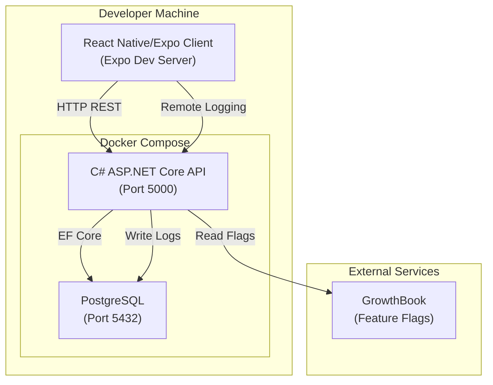

# Design Document

## Overview

The Wutsup Foundation establishes the project scaffolding, infrastructure, and development conventions for the Wutsup mobile application. It delivers two application projects (React Native/Expo client and C# ASP.NET Core API), a PostgreSQL database, centralized logging for both tiers, multi-environment configuration, a single-command local development environment, and steering files for AI-assisted development.

The architecture follows a standard two-tier mobile pattern: a React Native client communicates with a REST API backend, which persists data in PostgreSQL. Docker Compose orchestrates the local development stack.

## Architecture



**Key architectural decisions:**

1. **Expo Managed Workflow** — Simplifies native builds and OTA updates. The client uses file-based routing via Expo Router.
2. **EF Core with Code-First Migrations** — Keeps schema in source control and auto-applies on local startup.
3. **Docker Compose for local dev** — Single `docker-compose up` provisions DB and API; the client runs via Expo CLI outside Docker (hot reload is faster on host).
4. **Centralized logging abstraction** — Both client and API route logs through a single module, enabling consistent formatting and optional remote shipping.
5. **GrowthBook for runtime log control** — Production log verbosity is toggled without redeployment.

## Components and Interfaces

### Client Components

| Component | Location | Responsibility |
|-----------|----------|----------------|
| Logger | `/client/services/logger.ts` | Centralized logging with console and remote transport |
| Config | `/client/services/config.ts` | Environment configuration loading and validation |
| API Client | `/client/services/api.ts` | HTTP client configured with base URL from config |

**Logger Interface (Client):**

```typescript
interface LogEntry {
  timestamp: string;    // ISO 8601
  level: LogLevel;      // 'debug' | 'info' | 'warn' | 'error'
  source: string;       // Component or module name
  message: string;
}

interface Logger {
  debug(source: string, message: string): void;
  info(source: string, message: string): void;
  warn(source: string, message: string): void;
  error(source: string, message: string): void;
}

interface LoggerConfig {
  remoteLoggingEnabled: boolean;
  apiBaseUrl: string;
  minLevel: LogLevel;
}
```

**Config Interface (Client):**

```typescript
interface ClientConfig {
  apiBaseUrl: string;
  logLevel: LogLevel;
  remoteLoggingEnabled: boolean;
  environment: 'local' | 'qa' | 'staging' | 'production';
}

function loadConfig(): ClientConfig; // Throws with descriptive error if values missing
```

### API Components

| Component | Location | Responsibility |
|-----------|----------|----------------|
| LoggingService | `/api/Services/LoggingService.cs` | Writes structured logs to DB, respects level filtering |
| LogLevelFilter | `/api/Services/LogLevelFilter.cs` | Determines if a log entry should be persisted based on environment and feature flags |
| ConfigValidator | `/api/Configuration/ConfigValidator.cs` | Validates required config on startup |
| HealthController | `/api/Controllers/HealthController.cs` | Health-check endpoint |
| LogsController | `/api/Controllers/LogsController.cs` | Receives remote log entries from client |
| DbContext | `/api/Data/AppDbContext.cs` | EF Core context with Logs DbSet |

**LogLevelFilter Interface (API):**

```csharp
public interface ILogLevelFilter
{
    bool ShouldLog(LogLevel level, string environment, bool verboseLoggingEnabled);
}
```

**Filtering Rules:**
- Non-production environments (Local, QA, Staging): all levels pass
- Production with verbose flag enabled: all levels pass
- Production with verbose flag disabled: only Warn and Error pass

**ConfigValidator Interface (API):**

```csharp
public interface IConfigValidator
{
    /// Returns list of missing config key names. Empty list = valid.
    IReadOnlyList<string> Validate(IConfiguration configuration, string environment);
}
```

### Infrastructure

| Component | File | Responsibility |
|-----------|------|----------------|
| Docker Compose | `/docker-compose.yml` | Provisions PostgreSQL and API containers |
| API Dockerfile | `/api/Dockerfile` | Builds and runs the API |
| DB Init Script | `/db/init.sql` | Optional seed data |

## Data Models

### Log Entry (Database)

```sql
CREATE TABLE logs (
    id BIGSERIAL PRIMARY KEY,
    timestamp TIMESTAMPTZ NOT NULL DEFAULT NOW(),
    level VARCHAR(10) NOT NULL,       -- 'debug', 'info', 'warn', 'error'
    message TEXT NOT NULL,
    source VARCHAR(255) NOT NULL,
    correlation_id UUID,
    created_at TIMESTAMPTZ NOT NULL DEFAULT NOW()
);

CREATE INDEX idx_logs_timestamp ON logs (timestamp DESC);
CREATE INDEX idx_logs_level ON logs (level);
CREATE INDEX idx_logs_correlation_id ON logs (correlation_id);
```

**EF Core Entity:**

```csharp
public class LogEntry
{
    public long Id { get; set; }
    public DateTimeOffset Timestamp { get; set; }
    public string Level { get; set; } = string.Empty;
    public string Message { get; set; } = string.Empty;
    public string Source { get; set; } = string.Empty;
    public Guid? CorrelationId { get; set; }
    public DateTimeOffset CreatedAt { get; set; }
}
```

### Environment Configuration Schema

**API (`appsettings.{Environment}.json`):**

```json
{
  "ConnectionStrings": {
    "DefaultConnection": "Host=localhost;Port=5432;Database=wutsup;Username=wutsup;Password=wutsup"
  },
  "App": {
    "Environment": "Local",
    "LogLevel": "Debug"
  },
  "GrowthBook": {
    "ApiHost": "https://cdn.growthbook.io",
    "ClientKey": ""
  }
}
```

**Client (`.env.{environment}`):**

```
API_BASE_URL=http://localhost:5000
LOG_LEVEL=debug
REMOTE_LOGGING_ENABLED=false
ENVIRONMENT=local
```

## Correctness Properties

*A property is a characteristic or behavior that should hold true across all valid executions of a system — essentially, a formal statement about what the system should do. Properties serve as the bridge between human-readable specifications and machine-verifiable correctness guarantees.*

### Property 1: Client log entries contain required metadata

*For any* log message with any valid level and any non-empty source string, the formatted log entry produced by the Client Logger SHALL contain a valid ISO 8601 timestamp, the log level, and the source identifier.

**Validates: Requirements 4.5**

### Property 2: API log entries contain required fields

*For any* log entry created by the API Logger, the resulting LogEntry object SHALL have non-null/non-empty values for timestamp, level, message, source, and a correlation identifier (which may be null but the field must exist).

**Validates: Requirements 5.2**

### Property 3: Log level filtering correctness

*For any* log entry with any level, in any environment, with any verbose-flag state, the entry passes the LogLevelFilter if and only if: the environment is non-production, OR the level is warn or error, OR the verbose logging flag is enabled.

**Validates: Requirements 5.3, 5.4, 5.5**

### Property 4: API configuration validation identifies missing keys

*For any* non-empty subset of required configuration keys that is removed from the configuration, the API ConfigValidator SHALL return a list that contains exactly the names of the removed keys.

**Validates: Requirements 6.4**

### Property 5: Client configuration validation identifies missing values

*For any* non-empty subset of required environment variables that is removed from the configuration source, the Client config loader SHALL throw an error whose message contains the names of all missing variables.

**Validates: Requirements 6.5**

## Error Handling

| Scenario | Component | Behavior |
|----------|-----------|----------|
| Missing config value at startup | API ConfigValidator | Logs descriptive error naming the missing key, throws `InvalidOperationException`, prevents startup |
| Missing config value at startup | Client Config | Throws error with message listing missing env vars; app displays error screen |
| Database unreachable | API LoggingService | Falls back to console logging; does not crash the request pipeline |
| Remote logging endpoint unreachable | Client Logger | Silently falls back to console-only; queues entries for retry (best-effort) |
| Migration failure on startup | API | Logs error and exits with non-zero code; Docker Compose restart policy retries |
| GrowthBook unreachable | API LogLevelFilter | Defaults to production-safe behavior (warn/error only) |
| Invalid log level string | Both | Defaults to `info` level and logs a warning about the invalid value |

## Testing Strategy

### Unit Tests

- **Client Logger**: Verify each method produces correct output format; verify remote transport is called when enabled; verify console-only when disabled.
- **API LogLevelFilter**: Verify filtering rules for each environment/flag combination.
- **API ConfigValidator**: Verify detection of each required key when missing.
- **Client Config Loader**: Verify error messages for missing env vars.

### Property-Based Tests

Property-based testing applies to the logging and configuration validation logic in this feature. The following libraries will be used:

- **Client (TypeScript)**: `fast-check` — minimum 100 iterations per property
- **API (C#)**: `FsCheck` (with xUnit adapter) — minimum 100 iterations per property

Each property test will be tagged with a comment referencing the design property:
- Format: `Feature: wutsup-foundation, Property {number}: {property_text}`

Properties to implement:
1. Client log entry metadata completeness (Property 1)
2. API log entry field completeness (Property 2)
3. Log level filtering correctness (Property 3)
4. API config validation error reporting (Property 4)
5. Client config validation error reporting (Property 5)

### Integration Tests

- **Health-check endpoint**: Start API, verify GET `/health` returns 200.
- **Database connectivity**: Start Docker Compose stack, verify API can write and read from PostgreSQL.
- **Migration application**: Start stack, verify EF Core migrations table exists.
- **Remote logging round-trip**: Client sends log to API endpoint, verify row appears in logs table.

### Smoke Tests

- **Project structure**: Verify expected directories exist in `/client` and `/api`.
- **TypeScript strict mode**: Verify `tsconfig.json` has `strict: true`.
- **Docker Compose validity**: Verify `docker-compose config` succeeds.
- **Steering files exist**: Verify all three steering files are present with expected content sections.
